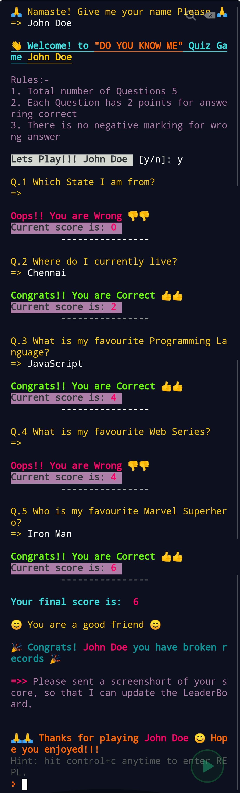

# Do You Know Me

Hey! Welcome to my Quiz Game "**Do You Know Me**".

It's a JavaScript CLI app hosted on repl.it. I have build it while learning web dev with [neoGcamp](https://neog.camp/)

It's a 5 question Quiz Game which asks questions about me to test how much do you know me. I have used `readlineSync()` as a dependency to take user input and [CHALK](https://www.npmjs.com/package/chalk) to beautify the app.

## Play it here :

[Do You Know Me](https://repl.it/@SouvikBiswas1/CLIQuizApp?embed=1&output=1#index.js)

### Screenshot

